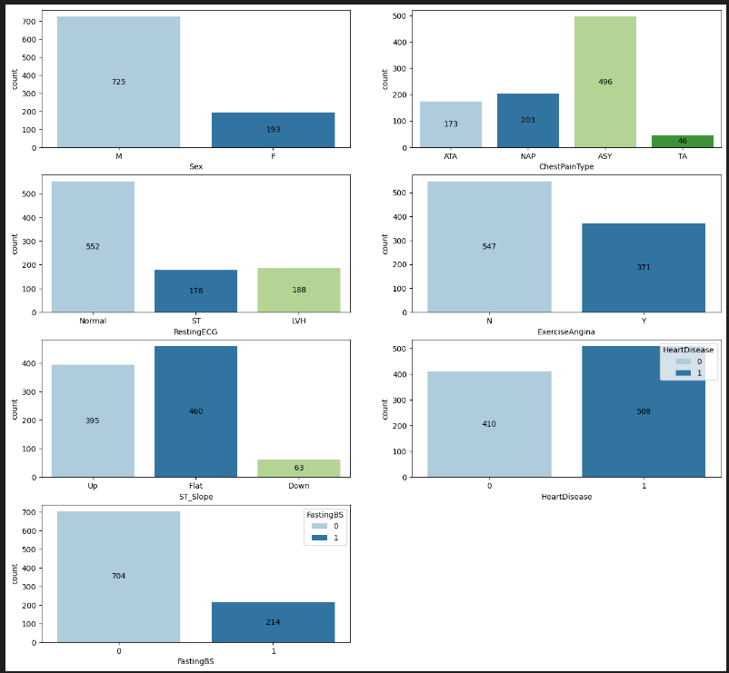
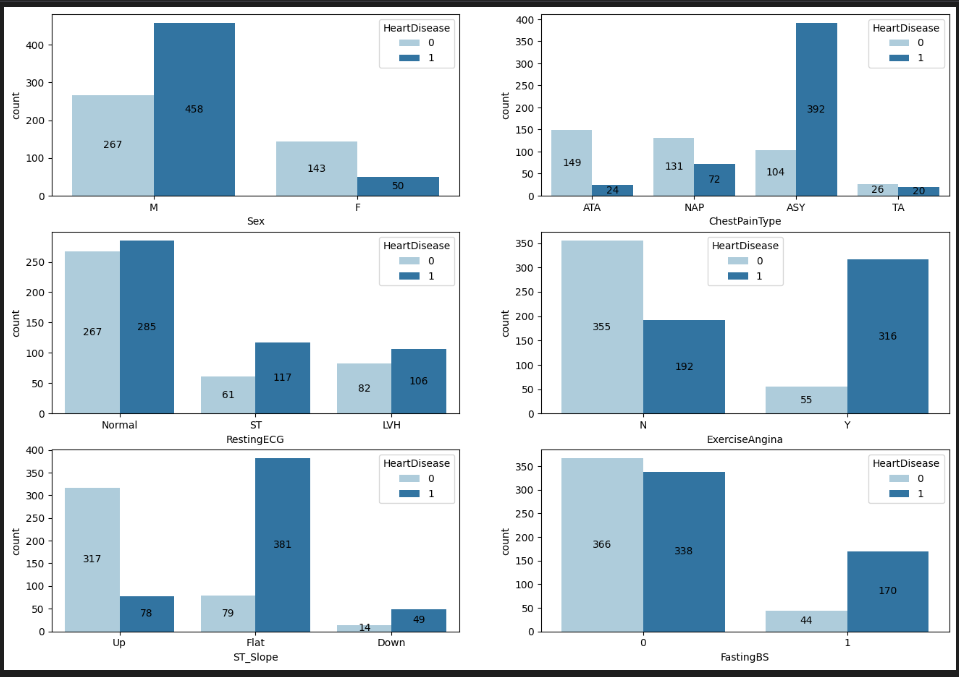
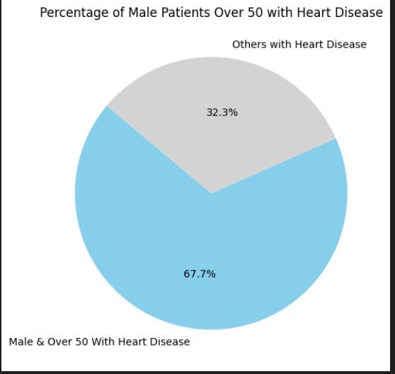
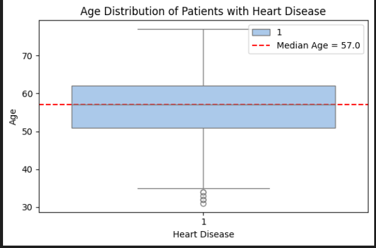
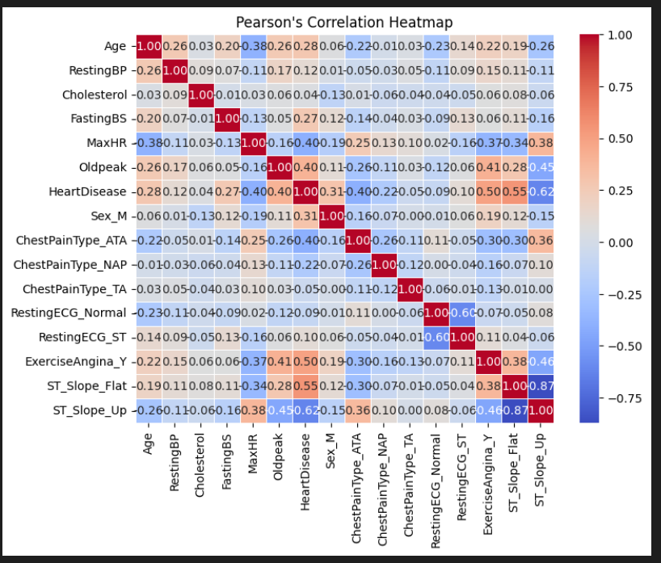
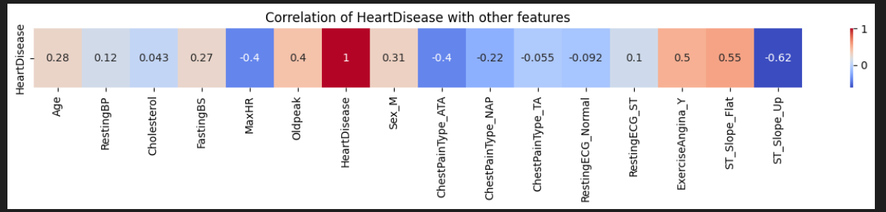
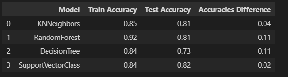

# Project: Predicting Heart Disease
This project accurately predicts the likelihood of a new ptient having heart disease in the future.

There a multiple risk factors that could contribute to cardiovascular disease (CVD) in an individual such as unhealthy diet, lack of physical activity, or mental illness. Identifying these risk factors early on could prevent many premature deaths.

This project is useful for companies providing healthcare solutions.
# The Dataset
The Kaggle dataset contains anonymized data from multiple hospitals on several patients. It includes relevant information for each patient, such as their personal information and some medical data, including whether or not they have had heart disease before.

The dataset has the following features:
- `Age`: age of the patient [years]
- `Sex`: sex of the patient [M: Male, F: Female]
- `ChestPainType`: chest pain type [TA: Typical Angina, ATA: Atypical Angina, NAP: Non-Anginal Pain, ASY: Asymptomatic]
- `RestingBP`: resting blood pressure [mm Hg]
- `Cholesterol`: serum cholesterol [mm/dl]
- `FastingBS`: fasting blood sugar [1: if FastingBS > 120 mg/dl, 0: otherwise]
- `RestingECG`: resting electrocardiogram results [Normal: Normal, ST: having ST-T wave abnormality (T wave inversions and/or ST elevation or depression of > 0.05 mV), LVH: showing probable or definite left ventricular hypertrophy by Estes' criteria]
- `MaxHR`: maximum heart rate achieved [Numeric value between 60 and 202]
- `ExerciseAngina`: exercise-induced angina [Y: Yes, N: No]
- `Oldpeak`: oldpeak = ST [Numeric value measured in depression]
- `ST_Slope`: the slope of the peak exercise ST segment [Up: upsloping, Flat: flat, Down: downsloping]
- `HeartDisease`: output class [1: heart disease, 0: Normal]

# Findings and Visualizations
## Counts for Each of the Categorical Columns Categories

**Sex:** There are more males than females (725 versus 193) 
**ChestPainType:** Most of the patients have asymptomatic chest pain type: ASY (493), NAP (203), ATA (173), TA  
**RestingECG:** Normal RestingECG is the most common.
**ExerciseAngina:** Nos are more that Yeses  
**ST_Slope:** Flat, Up, then Down  
**HeartDisease:** 1(presence of heart disease) more than 0 (absence of heart disease)  
**FastingBS:** 0 is more than 1  

Grouping these by `HeartDisease` gives us a better idea about the data distribution.
## Categorical Columns Grouped By Heart Disease

**Sex:** Males have a higher count of patients with heart disease than females.  
**ChestPainType:** ASY has the highest count of patients with heart disease. This indicates that a significant number of patients diagnosed with heart disease have asymptomatic chest pain. While chest pain could be a relevant feature for the model, asymptomatic implies that those patients who had heart disease did not have chest pain as a sympton.
**RestingECG:** Most of the patients diagnosed with heart disease had a normal resting ECG.  
**ExerciseAngina:** Out of all the patients with exercise-induced angina, 316 were diagnosed with heart diease.   
**ST_Slope:** Out of all the patients with a flat ST Slope, 381 were diagnosed with a heart disease.   
**HeartDisease:** 1(presence of heart disease) more than 0 (absence of heart disease)    
**FastingBS:** A high number of patients with blood sugar greater than 120 mg/dl were diagnosed with heart disease in relation to those who were not diagnosed as such.  

## Percentage of Patients With Heart Disease That Are Male and Over 50 Years Old

## The Median Age of Patients Diagnosed With Heart Disease

# Feature Selection
Thanks to our EDA and a general understanding of the features, we can identify some of the features we could start with:  
- **Age**
- **Sex**
- **ChestPainType**
- **Cholesterol**
- **FastingBS**

We will also identify how strongly the feature columns are correlated to the target column. This could help us narrow down on the features.

In order to do that, we will first convert our categorical columns into dummy variables.

### Create a Pearson's Correlation Heatmap

The correlation coefficient threshold was chosen based on what made sense when looking at the heat map.
Surprisingly, Cholesterol is not strongly correlated to HeartDisease. We can consider ignoring the feature for now.

Given everything we have attempted so far, we can narrow down the features that might be relevant. These are:
- `Oldpeak`
- `ExerciseAngina_Y`
- `ST_Slope_Flat`
- `MaxHR`
- `ChestPainType_ATA`
- `ST_Slope_Up`
Next, we will create and train multiple models using all of these features.

# Best Model results after hyperparameter tuning for each

# Conclusion
1. Model's Performance:
The final model is the SVC model with an accuracy of 82%, suggesting that it performs well at predicting the presence of heart disease based on the provided features. 

The final model was trained on the following features: 
- `Oldpeak`
- `ExerciseAngina_Y`
- `ST_Slope_Flat`
- `MaxHR`
- `ChestPainType_ATA`
- `ST_Slope_Up`
2. Potential Improvements to get better results:
- Feature Engineering: Adding more relevant features like smoking status, family history, or BMI might improve performance.
- Hyperparameter Tuning: Expanding the grid search with additional parameters such as p for Minkowski distance.
- Exploring other algorithms  that could perform better than SVC like ensemble ones
- Try and collect more data.
- Experimenting with another scaling method e.g. standardscaling